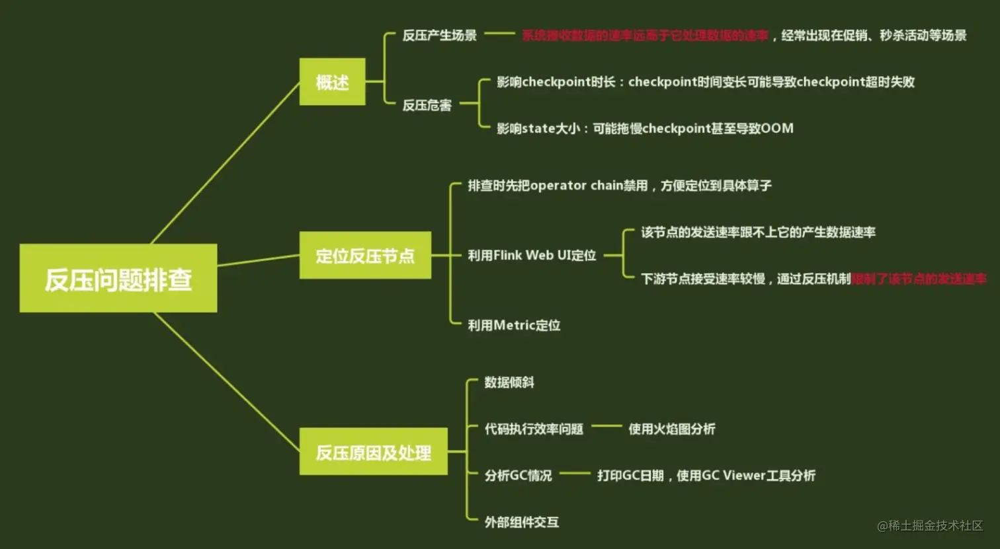

https://juejin.cn/post/6912802614518218765

# flink系统架构

flink CLIENT端根据提交的代码生成streamGraph， 然后在优化成JobGraph，发送给jobmanager进行处理，jobmanager收到Jobgraph之后，会生成具体执行的executionGraph。然后根据executionGraph进行调度具体的taskmanager。

job manager主要负责的是整个flink集群的任务调度以及资源管理以及checkpoint的协调工作等，里面有jobmaster，dispatcher，以及resourcemanager三个大的模块。jobmaster就负责将jobgraph转化成executionGraph，然后去申请资源，向taskmanager分发任务，还有一些检查点的协调

dispatcher提供了rest接口，负责一些web ui的。resourcemanager 就是负责资源调度分配和回收的。

taskmanager 就是具体的工作进程，负责具体的任务执行，一个flink任务会产生多个taskmanager。一个taskmanager会包含多个task slots。

flink task slots parallelism subtask的概念

flink中的task是一个逻辑概念，是工作的基本单元，一个operator就是一个task，如果多个操作符被chain到之后产生的一个新的operator算一个task，比如map，filter等

subtask就是子任务，是具体执行和调度的基本单元，如果一个操作符有多个并行任务，就会把task拆分成多个子task。subtask可以理解为在具体执行的时候根据并行度设置产生的运算算子实例，每个subtask需要一个线程来执行。

parallelism 并行度，就是并行执行的subtask的个数

task slot。每个taskmanager都是一个进程，一个task manager会包含多个slot。每个task slot 代表task manager的固定的资源子集。同时，flink提出sub-task可以共享slot，一个slot可以运行多个subtask，但是这些subtask必须是不同task的subtask。

共享的好处：充分的资源利用，以及共享之后task slots数量等于作业最高的并行度。flink默认是允许资源发生共享的。

operator chain 

chain的优点就是所有subtask都在一个线程里面执行，能够减少数据交换，序列化和一些上下文切换，提高作业执行效率。

算子链是在streamgraph生成jobgraph时间段产生的。

chain在一起的条件：

上下游算子并行度一致

没有禁用算子链

上下游之间没有发生shuffle，也就是下游节点的入度是1

下游节点和上游节点的策略(alway 或者 head)

两个算子的数据分区是forward

上下游节点在同一个SlotSharingGroup中

算子类型

flink 的时间概念

processing time 处理时间。是数据流入到具体的算子时候的系统时间

event time 时间在现实世界中发生的时间

Ingestion Time 提取时间，是flink读取数据源的时间。

flink 窗口分类

滚动窗口   滚动窗口大小固定且不重叠

滑动窗口   滑动窗口可以发生重叠，窗口大小10分钟，滑动时间5分钟

会话窗口   在一段时间内没有接收到元素则进行关闭，定义不活动时间的长度。

watermark

基本概念：watermark是一种衡量event time进展的机制。用来处理实时数据中乱序问题的，通常是结合窗口进行实现。数据流从产生到sink，中间是有过程和时间的，大部分情况下是按照事件发生事件到来的，但是不排除网络和反压等原因，导致乱序的产生。对于乱序延迟的数据，我们不能无限期的等下去，必须有机制来触发窗口的计算，这个就是watermark。

数据流中的watermark表示，timestamp比watermark小的数据都已经到达了。窗口触发方式：通过窗口的最大的MAX event_time - 延迟时间 所得到的watermark 和原窗口的触发时间做对比，如果watermark比原始窗口触发时间还要大，则触发窗口执行。

waterMark是数据携带的，如果运行过程中没有获取新的数据，那么没有触发的窗口将永远不会触发。

watermark 生成的两种方式 从指定的标记性事件中生成，或者周期生成

多并发场景下， watermark是以广播的形式传播到下游算子，下游算子选择最小的watermark作为当前的watermark

allow lateness事件

虽然设置了水位线，表示早于他的时间不在出现，但是仍然会接收到水位线之前的消息。也就是迟到时间，迟到事件是乱序事件的特例，他们超过了水位线的预计，导致他们到来的时候窗口已经关闭。这种时候有3种处理方案：

重新激活关闭的窗口并重新计算

将事件收集起来另外处理

直接丢弃

flink默认是进行直接丢弃的。其他两种分别用side output 和allow lateness。allow lateness允许用户设置一个最大的迟到时长，flink关闭窗口后会保存窗口的状态，迟到时间不会丢弃，会重新触发窗口计算，并且是来一次迟到数据就出发一次窗口全量计算，同时这个时长要合理设置。

state https://juejin.cn/post/6844904053512601607

state是一种为了满足算子计算时需要历史数据，使用checkpoint机制容错，存储在state backend的数据结构，比如去重，窗口计算等

常见的state类型有keyed state，应用在keyedstream上，多个subtask的同一个key共享同一个state。另外还有operator state，他是和poerator实例进行绑定的，比如说source state。这种就是同一个subtask共享同一个state。

支持的类型：Value state。 Mapstate。listState等。

state backend 类型：

memoryStateBackend. state存储在taskmanager上，checkpoint存储在jobmanager上。基本上都是在本地测试使

FsStateBackend。state存储在taskmanager上，checkpoint存储在本地hdfs上。 大状态，大窗口，高可用

rocksdbbackend。state存储在rocksdb上，checkpoint存储在本地hdfs上。大状态，大窗口，高可用

区别：RocksDBStateBackend比Fs 维护的状态更大。同时也是唯一一种支持增量cp的状态后端。

反压

checkpoint

流计算是24小时不停运行的，但是当状态很大，或者系统崩溃等其他问题的时候，需要保证任务在重启的时候能够正确的执行，这个时候就需要容错机制，保证flink的任务可靠性。checkpoint机制就是flink可靠的基石，可以保证flink集群在因为某些原因出现故障的时候，能够将整个应用的状态恢复到故障之前的一个状态，保证状态的一致性。

barrier。

flink分布式快照的核心概念就是barrier。这些barrier被插入到数据流中，作为数据流的一部分和数据一起向下流动。barrier把数据流分割成两部分，一部分进入到当前快照，一部分进入到下一个快照。

jobmanager会创建一个ckeckpoint调度器负责快照制作 。barrier在数据源端被插入，当算子收到barrier时候，会立刻进行快照操作，快照结束之后，会向下游operator广播barrier。下游以此类推。每个节点的快照制作成功后，会发送确认消息到jobmanager。如果checkpoint调度器接收到所有的operator的确认消息，就会通知所有operator快照制作完成。

当制作存储快照的时候，会停止处理数据，这种会造成数据延迟。可以在存储的时候，operator异步快照复制出的状态，然后马上发射barrier。然后后台异步做快照。

barrier对齐问题。

接收到超过一个输入流的operator就需要进行barrier对齐。

operator只要接收到一个输入流的barrier，就不能继续处理此数据流后面的数据，会将数据存入到缓存，直到operator接收到其余数据流的barrier,然后对齐操作完成，触发checkpoint操作，之后开始计算缓存中数据，全部放行。

这种对齐会降低数据的吞吐量，如果不需要exactly_once, 就可以不使用barrier对齐，这样就能增加吞吐量，但是恢复的时候，就会出现重复消费，也就是at least once。

端到端一致性

# flink分布式缓存和广播变量的区别
1. 广播变量是基于内存的，将变量分发到每个taskmanager的内存上
2. 分布式缓存是基于磁盘的，将文件copy到taskmanager的文件系统上，然后可以访问它

# flink 分区策略(8种)
1. globalpartitioner
   1. 数据备份发到下游算子的第一个实例中进行处理

2. forwardpartitioner
   1. 应用在datastream上，生成一个新的datastream。通常用于在同一个operatorChain上下游算子之间的数据转发，实际上数据是直接传递给下游的

3. shufflepartitoner
   1. 随即将元素进行分区，确保下游的task能够均匀的获得数据

4. rebalancepartitioner
   1. 以轮询的方式为每个元素进行分区，确保下游能均匀的获取数据，避免发生数据倾斜

5. rescalepartitioner
   1. 根据上下游task数量分区。如果上游有两个source，下游6个map，那么一个分配3个。不会向没有分配的分区写入数据，而rebalance会向所有分区写入数据

6. broadcastpartitioner
   1. 广播给所有分区

7. keygroupstreampartitioner
   1. 应用在keyedstream上，生成一个新的keyedstream

8. customerpartitioner
   1. 自定义分区

# Flink任务延迟高，想解决这个问题，你会如何入手？(https://juejin.cn/post/7108916224993525774)
在flink 的web ui中可以看到flink的哪个算子和task出现了反压

对任务进行资源调优和算子调优。资源调优即对作业的并发数，cpu，内存等参数进行调优
作业参数调优：并行度设置，state设置，checkpoint设置.

# 如何排查生产环境中的反压

1. 禁用operator chain，方便定位到具体算子
2. 利用web ui进行定位看是哪个算子
3. 如果是数据倾斜，则两阶段聚合。如果是代码执行效率问题，则分析代码问题，拉一些火焰图进行分析。GC的问题可以查看GC日志

# 海量数据去重
1. 布隆过滤器
2. bitmap去重
3. state状态去重
4. redis tair 外部存储去重

# flink大状态调优
https://blog.csdn.net/m0_51111980/article/details/130075743

# 增量快照和全量快照
https://cloud.tencent.com/developer/article/1506196
# flink sql join
目前常见的流流实现方式主要有interval join 和regular join 两种。
1. interval join: 窗口关联。interval join 会将左右两条流的数据都换存在状态中，当任意一条流数据到达时，去缓存里面找，如果找到则下发，如果找不到，则等待，超过周期的时候如果是outer join则补全null 下发。 这种就是需要等待，不希望数据重复，不希望下发错误数据。
2. regular join 。将两条流的数据缓存在状态中，一条流的数据到达的时候，会去缓存里面找，如果没有找到，则补全null下发。如果找到，先判断之前是不是下发过补全null的数据切没有被撤回，如果下发过，则进行撤回，然后再下发关联上的数据。

# flink 多流join
1. join算子
类似于inner join，按照指定字段进行inner join 是基于窗口的
2. cogroup算子
也是基于窗口的，但是可以实现left join 或者right join
3. connect算子
将两条流的数据连接起来，两条流的数据有有不同的处理方法，可以自己实现各种join
4. interval join算子
是在keyedstream上的操作，按照指定字段以及右流相对左流的指定时间偏移长度来关联，已经支持各种类型的join。官网文档不准确（https://www.jianshu.com/p/11b482394c73）

# flink 算子扩容缩容的状态迁移（https://blog.csdn.net/shirukai/article/details/108690464）
为了避免状态迁移时造成的性能影响，Flink并不是每个key都重新分区。而是先将key进行分组(一致性哈希)，之后一组一组重新分配。
相同KeyGroup的记录，不管并行度如何改变，他们最终会在同一个SubTask中被处理。

