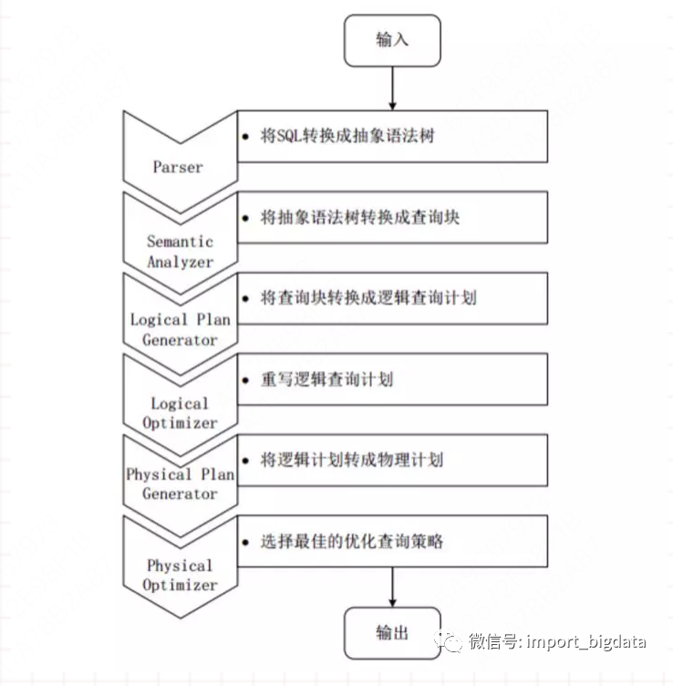
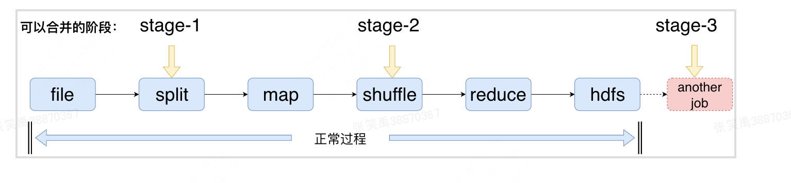

# mapreduce的流程（https://blog.csdn.net/ASN_forever/article/details/81233547）
1. input
   1. 数据首先进行mapreduce框架中
2. split
   1. 大规模数据数据经过split被分割成小的数据集，同时数据预处理成map更容易处理的kv结构
3. map
   1. 每个map任务都有一个环形的内存缓冲区，输入的数据经过map任务处理的中间结果之后会先写入到环形缓冲区中，如果缓冲区达到阈值则将内存中的数据写入磁盘，同时会对key进行排序和合并。最后，所有临时的溢写文件还会再做一次归并将所有文件中相同的partition合并到一起。
4. shuffle
   1. reduce端不断拉取当前job每个map端task的结果，然后对不同地方的数据进行merge最后合并成一个分区相同的大文件，然后对文件中的数据进行排序和分组
5. reduce
   1. 按照用户的需求进行操作，以kv形式输出结果
6. output
   1. 结果写入文件

# mapreduce 和spark 的区别 （https://blog.nowcoder.net/n/f15a0bceaaef4c08946a5dffc2f1dc5a?from=nowcoder_improve）

https://www.zhihu.com/question/31930662

1. mapreudce每次都需要把计算的结果写入到磁盘，然后在从磁盘上读取数据在进行计算，这样就是频繁的IO.而spark得益于RDD和DAG(记录了job的stage以及job在执行过程中的父子RDD的依赖关系),可以将中间结果写入到内存中，减少磁盘IO。
2. mapreduce在shuffle阶段需要花费大量时间排序，排序不可避免，而spark在shuffle只有在部分场景下才需要排序。
3. spark是粗粒度申请资源，mapreduce是细粒度申请资源
   1. 粗粒度申请资源是在提交资源的时候，spark会向资源管理器将资源申请完毕，不需要task区申请资源。
   2. mapreduce则是task自己申请资源，这样任务运行的很慢。

# 为什么spark比mapreduce快（https://www.zhihu.com/question/31930662）
1. mapreduce框架中，一个程序只能拥有一个map一个reduce的过程，如果运算逻辑很复杂，一个map+一个reduce是表述不出来的，可能就需要多个map-reduce的过程；mapreduce框架想要做到这个事情，就需要把第一个map-reduce过程产生的结果，写入HDFS，然后由第二个map-reduce过程去hdfs读取后计算，完成后又将结果写入HDFS，再交由第三个map-reduce过程去计算！ 重点！！！--这样一来，一个复杂的运算，在mapreduce框架中可能就会发生很多次写入并读取HDFS的操作，而读写HDFS是很慢的事情spark框架，则可以把上面的mapreduce-mapreduce-mapreduce的过程，连续执行，不需要反复落地到HDFS，这样就会比mapreduce快很多啦

# spark提交作业流程（https://www.cnblogs.com/jimmy888/p/13551719.html）
1.  客户端提交任务，创建driver进程并初始化sparkcontext， 在sparkcontext内部依次构建DAGscheduler和TaskScheduler。
2.  dirver向cluster manager申请资源，cluster manager收到申请之后，会在worker节点上为应用启动多个executor
3.  executor向driver发送注册并申请task
4.  sparkcontext根据rdd依赖关系构建出DAG图，dag提交给dagscheduler根据宽窄依赖解析成stage。每一个stage内部可以并行运行多个task，最后封装到taskset集合中，将taskset发送给taskscheduler。
5. taskscheduler拿到集合后，将task提交到executor进程上去执行。
6. task运行完成，driver向master发送注销请求，master通知worker关闭executor进程。

# spark 宽窄依赖
1. 宽依赖。指的是父RDD每个分区被多个子RDD分区使用
2. 窄依赖 父RDD每个分区只被一个子RDD分区使用

# spark如何划分stage
1. spark会因为不同的action操作划分成多个job。单个job从后往前遍历DAG,遍历过程中如果遇到宽依赖 则生成一个新的stage，如果遇到窄依赖，则继续向前遍历，知道遍历到DAG完成

# yarn cluster 和 yarn client 模式的区别
1. yarn cluster的driver进程托管给yarn管理
2. yarn client模式的driver进程运行在本地客户端，因为资源调度，任务分发，和yarn集群产生大量的网络通信，适合本地调试，不建议生产使用

# RDD特性
RDD 分布式弹性数据集。本身不存储数据，进作为数据访问的一种虚拟结构。
1. 分布式。RDD本质上可以看做是只读的，可分区的分布式数据集，支持多节点并行计算
2. 弹性。数据优先内存存储，当节点内存不够时，可以把数据刷新到磁盘外部存储
3. 容错性。RDD的血脉机制保存了RDD的依赖关系，同时支持checkpoint容错机制，当RDD遇到问题的时候可以进行重建

# spark广播变量和累加器
driver端将变量进行定义和修改，每个executor都拉取，在本地存储一份，executor只能读取，减少通信成本
累加器就是在executor端更新，最后在driver最终做汇总
# spark  sql 执行流程

1. parser模块，将spark sql字符串解析成抽象语法树，进行语法检查，词义分析等
2. analyzer模块 根据元数据信息对表中的字段进行解析，对抽象语法树的节点进行数据类型的绑定和函数的绑定，转换成查询块
3. Optimizer模块 选择最好的逻辑计划，并进行优化，比如谓词下推等
4. SparkPlanner模块 将逻辑计划转换成物理计划
5. 执行
# groupbykey 和reducebykey区别  CombineByKey
1. reducebykey在shuffle之前对分区内相同key的数据进行预聚合，减少落盘数据量，groupbykey只是进行分组，所以reducebykey性能比较高
2. reducebykey包含分组和聚合，groupbykey只能分组，不能聚合。

# spark数据倾斜
1. 

# spark小文件问题
1. 小文件带来的问题：
   1. 任务执行时间长。无论是从拉取元数据，还是从任务执行层面，一个小文件就对应一个map任务，就需要启动多个jvm。
   2. 元数据占用大量namenode内存，影响namenode性能
   3. 影响磁盘的寻址时间

2. 小文件产生的原因
   1. 比如说开启了动态分区，向动态分区插入数据的时候，会插入大量小文件
   2. reduce个数设置过多，产生大量小文件
   3. 源文件中就产生大量小文件

3. 小文件合并方法
   1. map阶段之前进行合并，可以解决输入小文件的合并，方式就是把多个小文件合并成一个数据分片，然后交给一个map task进行计算
   2. reduce合并 发生在shuffle阶段，将多个map的结果合并给下游的一个reducer，通过加大一个reducer处理的数据量来减少reducer task数量，减少小文件形成
   3. 写入hdfs后，可以解决输出小文件的合并，方式就是额外启动一个job，根据用户设置的阈值来合并小文件
   4. 多分区的小文件合并通过上面参数的方式不是能很好的解决。一个任务向多个分区插入数据，写入的小文件就是TASK数量 * 分区数量。这个时候可以在写入hdfs后再启动新的job来合并小文件，使用distribute by，将相同分区的数据分发的同一个task中，这样一个分区就会生成一个文件。

# spark容错机制
## spark checkpoint机制
1. 检查点对rdd的checkpoint是将数据的血统阶段，只保存了想要保存的rdd到hdfs上 cache则是存储到了内存当中。
2. cp是新建一个job来完成的，而cache则是在job执行过程中进行的
3. ck需要手动清除，cache在程序结束就被清除了

## 血缘机制
1. rdd只支持粗粒度转换，只记录单个块上执行的单个操作，然后将创建rdd的一系列变换操作记录(血缘)下来，以便恢复丢失的分区。

# spark 任务慢 如何排查
https://zhuanlan.zhihu.com/p/520398860