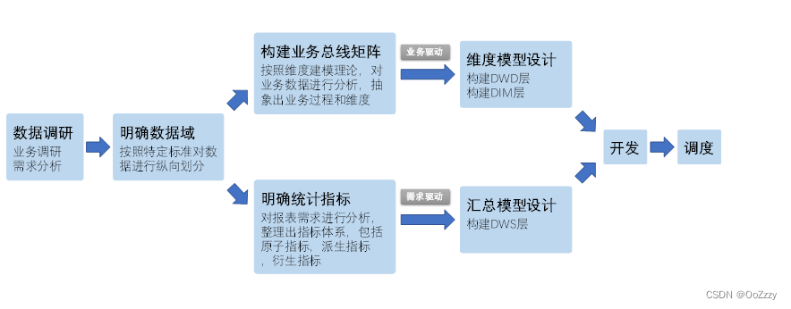

# 数仓主题和主题域
数仓主题是在较高层次上将企业信息系统中某一分析对象的数据进行整合、归类并分析的一种范围。
## 主题域以及主题的建设原则
主题域是指面向业务分析，将业务过程或者维度抽象的集合。为保障整个体系的生命力，主题域需要抽象提炼，并长期维护更新，但是不轻易变动。
划分主题域的时候，需要满足以下2点：
1. 能涵盖当前所有的业务需求
2. 能在新业务进入的时候，无影响的被包含进已有的主题域中和扩展新的主题域

备注： 主题域或者主题是无法一次划分完整的。业务是一直发展的，我们可以先优先级比较高的先行建设，然后后面不断进行迭代。

## 主题域划分思路
划分主题域，需要分析各个业务模块中有哪些业务活动。主题域可以按照用户企业的部门划分，也可以按照业务过程或者业务板块中的功能模块划分。
1. 按照所属系统划分。业务系统有几种就划分几种
2. 按照业务（功能模块、业务线）或者业务过程划分
3. 按照部门划分主题域
4. 按照行业案例分析划分主题域 比如十大金融主题模型

# 数据仓库构建流程

## 确定需求(业务建模)
对数据仓库进行构建之前，需要确定数仓构建的目标和需求，进行全面的业务调研，需要了解真实的业务需求是什么，以及整个业务系统能解决什么问题。
### 业务调研(业务建模)
1. 需要对业务的整体架构有所了解，各个业务模块之间的关系，熟悉业务流程
2. 各个已经有的业务系统的主要功能以及获取的数据。

1. 当前业务有哪些系统？
2. 业务系统之间的交互关系，数据传递关系是怎么样的？
3. 业务流程如何？业务方最关注的流程节点有哪些？
4. 业务的组织架构是什么样的？未来会有什么变化？
5. 各业务部门已知的需求有哪些？
6. 数据建模的范围界定，整个数据仓库项目的目标和阶段划分。

### 需求分析 (业务建模)
1. 通过和分析师，运营同学沟通来获取需求
2. 对报表系统中现有的报表进行研究分析

## 划分数据域(领域建模) 
1. 具体的数据调研，包括表级别，字段级别的数据情况深入调研
2. 分析业务过程
3. 划分数据域，比如交易域，流量域等

## 定义维度和构建总线矩阵(逻辑建模)
根据业务过程和维度划分出总线矩阵，也就是设计维度模型的过程

## 明确统计指标，梳理指标体系(逻辑建模)
依照指标体系建设标准，开始梳理指标体系。整个体系同样要以业务为核心进行梳理。同时梳理每个业务过程所需的维度。维度就是你观察这个业务的角度，指标就是衡量这个业务结果 好坏的量化结果
### 原子指标
### 派生指标
### 复合指标

## 数仓分层(逻辑建模)
ods
dwd
dws
dwt
app
## 数据建模(物理建模)
具体开发
## 数据质量

## 模型优化 长期迭代